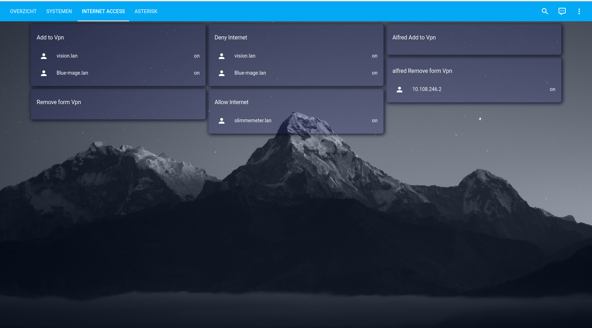

broken will write a better replacement

# ip-rule-switcher


allows management of internet access for IPV4 devices.
to deny internet access or use an alternative gateway like a vpn. 


start up.

edit  /etc/systemd/system/ip-rule-switcher.service
```
[Unit]
Description=IP Rule Switcher
After=network.target

[Service]
ExecStart=/usr/bin/php /opt/ip-rule-switcher/start.php
ExecStart=/usr/bin/php /opt/ip-rule-switcher/start_ha.php

[Install]
WantedBy=multi-user.target
```

```
sudo chmod 644 /etc/systemd/system/ip-rule-switcher.service
sudo systemctl daemon-reload
sudo systemctl enable ip-rule-switcher.service
```
